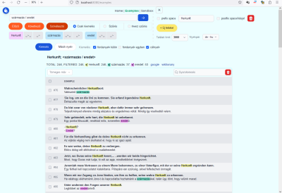
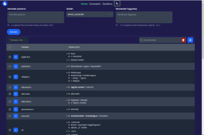
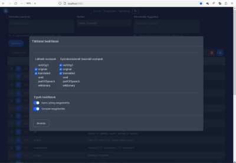
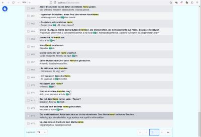
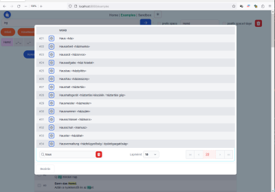
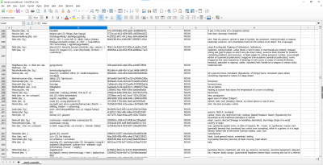

# velgengni_dict
A smart ODS-based dictionary handler with support for translation-example pairs

## Screenshots

## More details coming soon
A demo database, unit test and an end-to-end test suite is under construction.