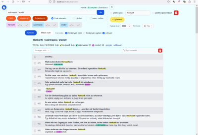
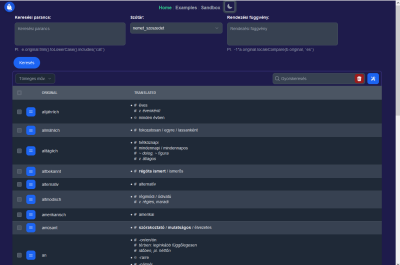
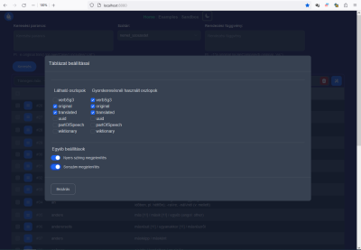
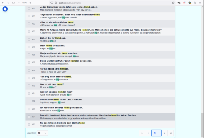
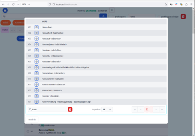
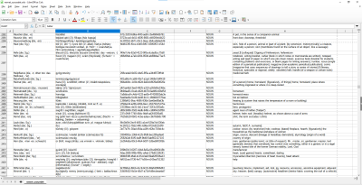

# velgengni_dict
A smart ODS-based dictionary handler with support for translation-example pairs

## Screenshots
[](./demo_screenshot_01.png)
[](./demo_screenshot_02.png)
[](./demo_screenshot_03.png)
[](./demo_screenshot_04.png)
[](./demo_screenshot_05.png)
[](./demo_screenshot_06.png)

## Development
This is a [pnpm](https://pnpm.io) workspace (`szotar_backend`, `szotar_frontend`, `libs/szotar_common`) driven by [Turborepo](https://turborepo.com).

```sh
npm install -g --allow-scripts=pnpm pnpm   # once
pnpm install                               # once, from the repo root
pnpm build                                 # builds szotar_common, then backend + frontend
pnpm dev                                   # runs backend and frontend (http://localhost:8080) together
```

Alternatively both parts of the project have a Windows batch file to build and run each of them.

The apps import the shared code by package name, e.g. `import type { Dict } from "szotar_common/models/Dict.js"`.

## More details coming soon
A demo database, unit test and an end-to-end test suite is under construction.